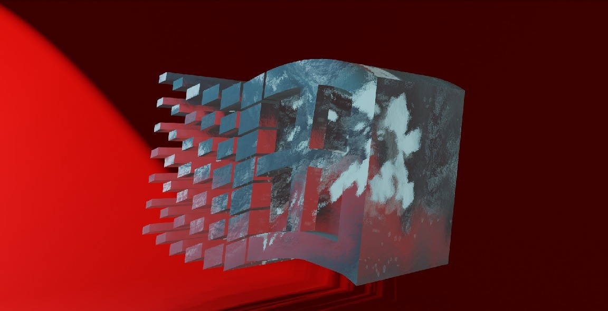
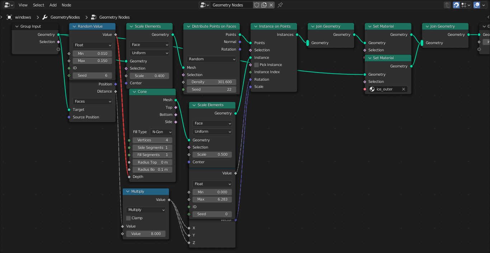
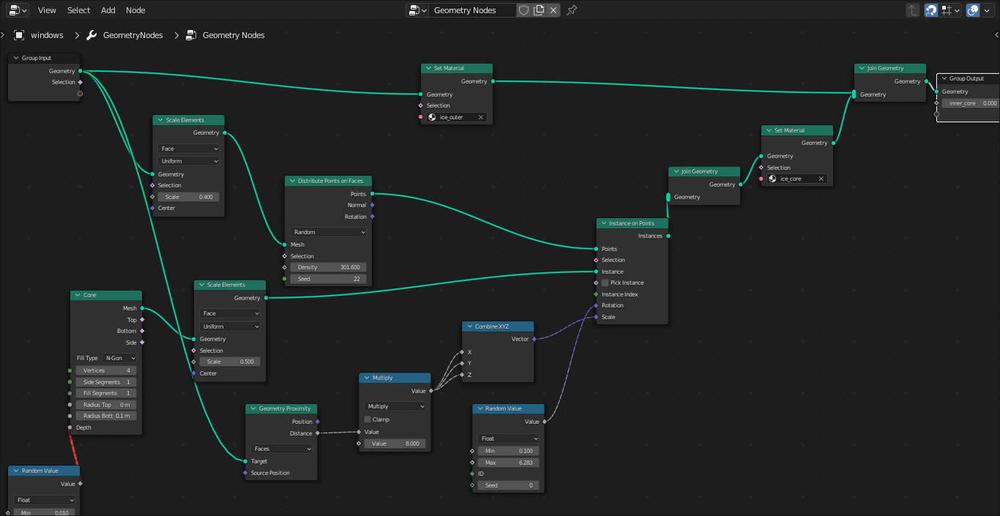
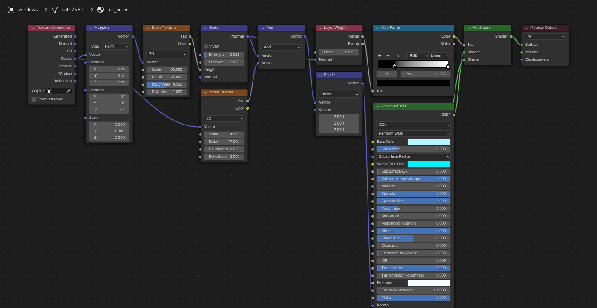

I had a brief tryst with Blender because I was very impressed with the software & it's physics engine & it was free & it is much better than coding manually.

I liked the fact that I can make any procedural material from any 3D model that could be conceived & wanted to try out my first Blender model.

I have chosen the 1990's Microsoft Logo for the 3D model, which evokes wistful memories when Microsoft had a better aesthetic for it's boxes & GUI applications & logo & font, IMO.

So this is Microsoft Logo as a block of ice.

Literally the only regret I have with this is that I could have made it shinier by lowering the "roughness" value in the Material Shader and very slightly more transparent. But what's done is done.

As with all realistic transparent ice, you need ice cores inside of the ice to give off the illusion of real ice, which is NOT so transparent as the bulk of the ice

What I COULD HAVE DONE was made another model inside of a model. I opted NOT to do that because it wasn't challenging enough for me, and it doesn't take advantage of Blender's new features that revolutionizes 3D modelling, and that new feature is called Geometry Nodes.

With Geometry Nodes, it seems highly close to no-code visual programming with nodes (looking like Google DataFlow), which offers far more flexibility than existing Blender modifiers.

Also with Geometry Nodes, the inner ice cores & non-transparent ice pieces will conform to the outer shape dynamically.

The exact Geometry Node to pull off this trick is the "Geometry Proximity Node"!! Thank goodness for it to make this possible!!! What it does is calculate the distance from the edge of any given model to make the calculations for the coordinates it's in. It is then fed into the Scale parameter of "Instance On Points" node to generate the thick inner core. Dynamically!

In the Geometry Node shader, it is setting the material of the center of the ice AND the material of the rest of the whole ice in different paths. Materials are called ice_outer & ice_core (may not be visible) 

# Geometry Nodes to generate the thick inner cores of the Microsoft Ice Model

# Same exactly Geometry Nodes, arranged a little differently for viewing purposes

# The Material Ice Shader for the whole ice (not the Geometry Nodes)

